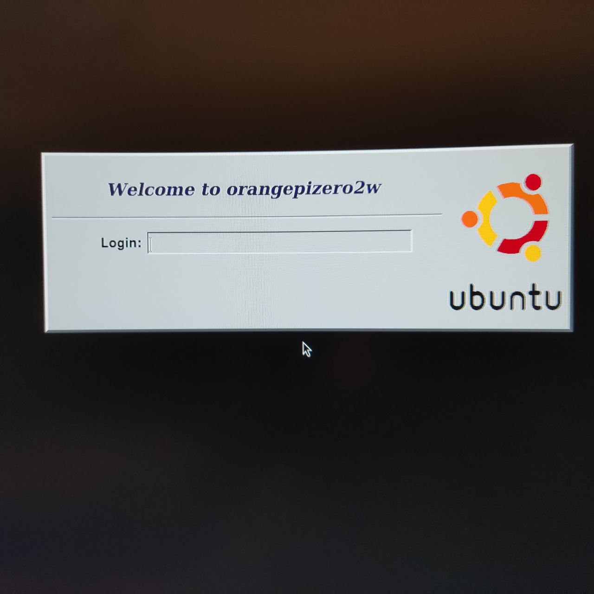

[English](README.md) | [Русский](README.ru.md)

# Проект CLST2: Создание кибердека на базе Orange Pi Zero 2W

[](https://shields.io)

> **Внимание:** 99% Этого проекта(в том числе почти все названия вроде "chiper-slot") было создано языковой моделью Gemini от Google, проект находится на стадии ранней беты. Возможны ошибки, отсутствие некоторых функций и частые изменения. Ваши отзывы и помощь приветствуются!

Это репозиторий проекта по созданию карманного персонального компьютера (КПК/кибердека) в ретро-стиле. Устройство основано на одноплатном компьютере Orange Pi Zero 2W и использует кастомные драйверы и детально настроенное Linux-окружение для комфортной работы на маленьком экране.

**Этот README содержит подробные инструкции по сборке, установке ПО и решения проблем, возникших в ходе разработки.**


<p align="center">
  
  <br>
  <em>Рис. 1 - Фотография моего открытого тестового стенда.</em>
</p>
## I. Концепция и Философия

*   **Цель:** Создать полностью функциональный, карманный Linux-компьютер с физической клавиатурой для разработки, администрирования и ретро-игр, обладающий модульной системой расширения.
*   **Вдохновение:** Классические КПК 90-х (Psion), ноутбук Toshiba T1100, и эстетика киберпанка.
*   **Интерфейс:** Полноценный, настраиваемый рабочий стол, адаптированный для экрана 320x240, без искусственных ограничений и оболочек.
## II. Аппаратные компоненты (Железо)

### Основные компоненты:
*   **Процессорный модуль:** Orange Pi Zero 2W
*   **Дисплей:** SPI 2.4" 320x240 (контроллер ST7789V)
*   **Клавиатура:** M5Stack CardKB (подключение по I2C)
*   **Устройство ввода (мышь):** Аналоговый джойстик, подключенный через Digispark ATTiny85 (эмулирует USB-мышь), под кодовым названием **"pseudoTrackpoint"**.
*   **Порт расширения:** **"Шифр-слот" (Cipher-Slot)**, ключевой компонент кастомной **"Мульти-картриджной Системы" (MCS)**, построенный на базе кардридера от системы NAGRA Syster.
*   **Аудиосистема:** I2S усилитель **MAX98357A** с внешним динамиком.
*   **Система охлаждения:** Вентилятор-турбина **4010 5V** с медными радиаторами.
*   **Питание:** Одноэлементный Li-Pol аккумулятор с платой зарядки и защиты **TP4056**.
*   **Корпус:** Кастомный, печатаемый на 3D-принтере (дизайн в разработке).

### Схема подключения (GPIO)

*(Номера пинов физические, для гребенки 26-pin Orange Pi Zero 2W. Обязательно сверяйтесь с актуальной распиновкой для вашей ревизии платы!)*

| Компонент      | Пин устройства | Пин на Orange Pi Zero 2W | Функция           |
|----------------|----------------|--------------------------|-------------------|
| **Дисплей (SPI1)** | VCC          | 3.3V (Пин 1)             | Питание           |
|                | GND            | GND (Пин 6)              | Земля             |
|                | MOSI           | SPI1_MOSI (Пин 19)       | SPI Data          |
|                | SCLK           | SPI1_SCLK (Пин 23)       | SPI Clock         |
|                | CS             | SPI1_CS (Пин 24)         | SPI Chip Select   |
|                | DC             | PA10 (Пин 7)             | Data/Command      |
|                | RST            | PA0 (Пин 11)             | Reset             |
|                | BL             | PA2 (Пин 13)             | Backlight (PWM)   |
| **Клавиатура (I2C0)**| VCC        | 3.3V (Пин 17)            | Питание           |
|                | GND            | GND (Пин 9)              | Земля             |
|                | SDA            | I2C0_SDA (Пин 3)         | I2C Data          |
|                | SCL            | I2C0_SCL (Пин 5)         | I2C Clock         |
| **Аудио (I2S0)** | VIN          | 5V (Пин 2 или 4)         | Питание усилителя |
|                | GND            | GND (Пин 14 или 20)      | Земля             |
|                | DIN            | I2S0_SDOUT (Пин 12)      | I2S Data Out      |
|                | BCLK           | I2S0_SCLK (Пин 35)*      | I2S Bit Clock     |
|                | LRC            | I2S0_LRCK (Пин 38)*      | I2S LR Clock      |
| **Вентилятор** | VCC (+)        | 5V (Пин 2 или 4)         | Питание           |
|                | GND (-)        | GND (через транзистор)   | Земля             |
|                | CTRL           | PA3 (Пин 15)             | Управление        |
| **Шифр-слот**  | *В разработке* | *Свободные GPIO*         | Кастомная шина    |

*\*Примечание по I2S: Пины 35 и 38 не входят в 26-пиновую гребенку. Необходимо уточнить их расположение для вашей платы и оверлея Armbian.*

*(Устройство мыши на Digispark подключается в один из свободных USB-портов Orange Pi).*
## III. Программное обеспечение (Софт)

### Стек ПО:
*   **ОС:** Armbian (Debian-based) для Orange Pi Zero 2W
*   **Драйвер дисплея:** Кастомная сборка [juj/fbcp-ili9341](https://github.com/juj/fbcp-ili9341).
*   **Драйвер клавиатуры:** Кастомный демон `cardkb_daemon` на C++.
*   **Система охлаждения:** Кастомный демон `fan_control_daemon` на C++.
*   **Аудиодрайвер:** Стандартный драйвер Linux ALSA, настроенный на работу через I2S.
*   **Графическая среда:**
    *   **Оконный менеджер:** Openbox
    *   **Панель задач:** tint2
    *   **Шрифты:** Terminus (растровый, для максимальной четкости)
    *   **Лаунчер:** dmenu

---

## IV. Установка и Настройка

Следуйте этим шагам для полной настройки системы с нуля.

### Шаг 1: Подготовка SD-карты и ОС

1.  Запишите свежий образ Armbian (Debian-based) для Orange Pi Zero 2W на SD-карту.
2.  Выполните первоначальную настройку системы: создание пользователя, подключение к Wi-Fi.

### Шаг 2: Настройка видеовыхода (Критически важный шаг!)

Чтобы драйвер `fbcp` работал корректно, ядро Linux должно рендерить рабочий стол в "виртуальный" монитор с низким разрешением.

1.  Откройте файл `/boot/armbianEnv.txt` для редактирования:
    ```bash
    sudo nano /boot/armbianEnv.txt
    ```
2.  Добавьте или измените строку `extraargs`, чтобы она включала следующий параметр:
    ```
    extraargs=video=HDMI-A-1:320x240@60
    ```
3.  Сохраните файл (`Ctrl+O`, `Enter`) и **сразу перезагрузите устройство**: `sudo reboot`.

### Шаг 3: Прошивка firmware для pseudoTrackpoint

Устройство мыши основано на кастомно запрограммированной плате DigiSpark. Необходимо скомпилировать и загрузить в нее прошивку.

1.  Перейдите в директорию `hardware_drv/pseudoTrackpoint-digiSpark-emu/` в проекте.
2.  Откройте файл `pseudoTrackpoint-digiSpark-emu.ino` в среде Arduino IDE.
3.  **Следуйте подробным инструкциям внутри файла скетча (.ino)** для настройки Arduino IDE, конфигурации ориентации джойстика и прошивки платы.
### Шаг 4: Запуск автоматической установки

Скрипт `install.sh` в этом репозитории выполнит все необходимые действия: установит зависимости, включит аппаратные интерфейсы, скомпилирует драйверы и настроит их на автозапуск.

1.  Клонируйте репозиторий:
    ```bash
    git clone https://github.com/ваш_логин/CLST2.git
    cd CLST2
    ```
2.  Сделайте скрипт установки исполняемым:
    ```bash
    chmod +x install.sh
    ```
3.  Запустите скрипт с правами суперпользователя:
    ```bash
    sudo ./install.sh
    ```
4.  Скрипт автоматически включит оверлеи I2C, SPI и I2S, установит и скомпилирует `cardkb_daemon`, `fan_control_daemon` и `fbcp`, а также настроит для них `systemd` сервисы.

### Шаг 5: Финальная перезагрузка

После завершения работы скрипта, он попросит вас перезагрузить устройство. Это необходимо для активации аппаратных интерфейсов (I2C, SPI, I2S).
```bash
sudo reboot
```

---

## V. Настройка рабочего стола Openbox

После первого входа вы увидите базовый экран входа XDM. Войдите в сессию Openbox, чтобы получить минималистичный рабочий стол. Давайте сделаем его более комфортным и функциональным.

1.  **Установка базовых компонентов рабочего стола:**
    Сначала установим более удобный терминал, файловый менеджер, утилиту для обоев (`feh`) и апплет для управления сетью.
    ```bash
    sudo apt install -y sakura pcmanfm feh network-manager-gnome
    ```
    *   `sakura`: Легковесный и приятный эмулятор терминала.
    *   `pcmanfm`: Быстрый и простой файловый менеджер.
    *   `feh`: Утилита для установки обоев рабочего стола.
    *   `network-manager-gnome`: Содержит `nm-applet`, который добавляет иконку Wi-Fi в трей.

2.  **Копирование стандартных конфигураций:**
    Чтобы начать кастомизацию, скопируем стандартные файлы конфигурации Openbox в вашу домашнюю директорию.
    ```bash
    mkdir -p ~/.config/openbox
    cp /etc/xdg/openbox/* ~/.config/openbox/
    ```

3.  **Настройка автозапуска:**
    Нам нужно указать Openbox, какие программы запускать при старте системы.
    ```bash
    # Открываем файл автозапуска в редакторе nano
    nano ~/.config/openbox/autostart
    ```
    Добавьте в этот файл следующие строки:
    ```bash
    # Устанавливаем черный цвет фона по умолчанию
    xsetroot -solid black &

    # (Опционально) Устанавливаем свои обои. Создайте папку Pictures и поместите туда картинку.
    # feh --bg-scale ~/Pictures/wallpaper.png &

    # Запускаем апплет Network Manager для иконки Wi-Fi
    nm-applet &

    # Запускаем панель tint2
    tint2 &
    ```
    Сохраните файл (`Ctrl+O`, `Enter`) и выйдите (`Ctrl+X`). Теперь сделайте его исполняемым:
    ```bash
    chmod +x ~/.config/openbox/autostart
    ```

4.  **Настройка tint2 для системного трея:**
    Нам нужно включить область уведомлений (системный трей) в нашей панели `tint2`.
    ```bash
    # Открываем конфигурационный файл tint2
    nano ~/.config/tint2/tint2rc
    ```
    Найдите строку, которая начинается с `panel_items = ...`, и добавьте в нее букву **S** (что означает System Tray). Обычно ее размещают перед часами (`C`).
    
    *   Пример: Измените `panel_items = LTSBC` на `panel_items = LTS**S**BC`

5.  **Перезайдите в систему или перезагрузитесь:**
    Чтобы применить все изменения, либо выйдите из сессии Openbox и войдите заново, либо просто перезагрузите устройство. Теперь вы должны увидеть функциональный рабочий стол с обоями и иконкой Wi-Fi на панели `tint2`!

<p align="center">
  
  <br>
  <em>Рис. 2 - Скриншот настроенной среды Openbox.</em>
</p>

<p align="center">
  
  <br>
  <em>Рис. 3 - Скриншот окна входа в систему XDM.</em>
</p>

---

## VI. Отладка и Решение Проблем

Этот раздел описывает проблемы, возникшие в ходе разработки, и их решения.

### Проблема: Не удается изменить разрешение экрана в VirtualBox
*   **Симптом:** При попытке изменить разрешение командой `xrandr` возникает ошибка `BadMatch (invalid parameter attributes)`.
*   **Причина:** Видеодрайвер гостевой ОС в VirtualBox не может корректно обработать кастомный видеорежим.
*   **Решение:** Установка "Дополнений гостевой ОС" (Guest Additions), использование `VBoxManage` или ручное изменение размера окна ВМ.

### Проблема: `tint2` не запускается автоматически с Openbox
*   **Симптом:** После перезапуска Openbox панель `tint2` не появляется, хотя вручную (`tint2 &` в терминале) запускается.
*   **Причина:** Файл `~/.config/openbox/autostart` не является исполняемым или не имеет "шапки" (shebang `#!/bin/bash`).
*   **Решение:** Проверить права на исполнение и наличие shebang. Полная перезагрузка сессии часто решает проблему.
---
## VII. Благодарности (Acknowledgements)

*   Спасибо **Google** за языковую модель **Gemini**, которая выступила в роли AI-ассистента и помогла в разработке и отладке многих программных решений.
*   Спасибо сообществу **Armbian** за отличную сборку Linux для одноплатных компьютеров.
*   Спасибо **juj** за великолепно оптимизированный драйвер `fbcp-ili9341`.
*   Спасибо **AlexGyver** за простую и мощную библиотеку **EasyHID** для Arduino.

**
      .--.
     |o_o |
     |:_/ |
    //   \ \
   (|     | )
   /`\_   _/`\
   \___)=(___/
   
**
Artwork by (R)(C)Gemini 2.5 pro